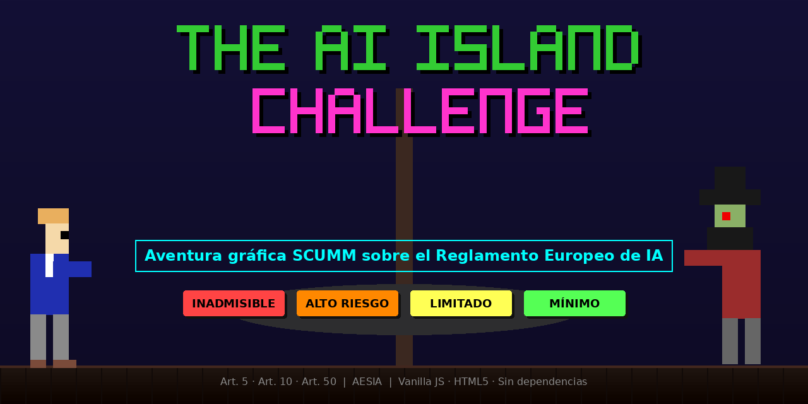

# The AI Island Challenge 🏴‍☠️




Este repositorio contiene el **minijuego de aventura gráfica interactiva** que he desarrollado para divulgar y auditar el cumplimiento del **Reglamento Europeo de Inteligencia Artificial (RIA)**.

> **Nota:** Este proyecto demuestra la viabilidad de crear recursos educativos y de concienciación legal altamente interactivos utilizando metodologías íntegras de Inteligencia Artificial (Vibe Coding).

## 📌 Características principales

*   **Diseño retro y motor SCUMM:** Interfaz clásica inspirada en *Monkey Island*, con panel de verbos (Mirar, Usar, Hablar a, Ir a...) y un sistema de inventario totalmente funcional.
*   **Puzles normativos:** 4 niveles de juego basados directamente en los niveles de riesgo del RIA (Mínimo, Limitado, Alto e Inaceptable).
*   **Totalmente autocontenido:** Toda la lógica, gráficos (SVG inline), diálogos y animaciones están empaquetados en un **único archivo HTML**, garantizando un despliegue y portabilidad inmediatos.
*   **Experiencia inmersiva y accesible:** 
    *   Uso integrado de **CSS3** para animaciones precisas (efectos de lava, barreras láser, movimiento del personaje).
    *   Sistema de diálogos interactivos que el usuario puede avanzar con clics fluidos.
*   **Rigor legal:** Adaptación lúdica pero fiel de artículos clave (Art. 5, Art. 10, Art. 50) y referencias a la guía de gestión de riesgos de la **AESIA**.

## 🗺️ Hoja de ruta

| Estado | Versión | Descripción |
| :---: | :--- | :--- |
| ✅ | **v1.0 — Actual** | Motor SCUMM completo con gráficos SVG originales autocontenidos en un único HTML. |
| 🔜 | **v2.0 — En desarrollo** | Rediseño visual con sprites pixel art de nueva creación, inspirados en la estética de las aventuras gráficas clásicas de los 90, para sustituir los gráficos vectoriales actuales por ilustraciones de mayor fidelidad artística. |

> 🎨 Los gráficos de la v2.0 serán diseños originales creados específicamente para este proyecto, inspirados en el estilo visual de las aventuras gráficas de LucasArts, sin utilizar assets protegidos por copyright de ningún juego comercial.

## 🤖 Desarrollo asistido por IA (Vibe Coding)

Este proyecto es un caso práctico en el que quería probar mis habilidades en **AI-Driven Development**. Todo el ciclo de vida del software, desde la conceptualización hasta el debugging, ha sido orquestado dirigiendo estratégicamente a modelos de IA avanzados:

1.  **Ideación y prototipado inicial:** Interacción con modelos generativos para diseñar la arquitectura SCUMM en Vanilla JavaScript y definir los puzles legales del minijuego.
2.  **Arquitectura y desarrollo HTML/JS:** Refactorización dinámica del código para asegurar que todo (incluidos los gráficos en SVG) quedara incrustado en un solo archivo, sin dependencias externas.
3.  **Auditoría y precisión jurídica:** Revisión profunda del *lore* del juego utilizando a modelos como **Claude Sonnet 4.6** para contrastar las afirmaciones de los personajes con el texto real del RIA y las guías de la AESIA, ajustando los diálogos para mantener el rigor sin perder el humor.
4.  **Debugging continuo de mecánicas (UX):** Resolución de fricciones de jugabilidad (bloqueo de movimiento, avance de diálogos,) debugeando iterativamente el motor SCUMM con agentes de IA.

## 🛠️ Stack tecnológico

*   **Core:** Vanilla JavaScript (ES6+), HTML5
*   **Estilado y Animación:** CSS3 puro (Flexbox, CSS Grid, Keyframes)
*   **Gráficos:** SVG inline autogenerado

## 💻 Instalación y uso local

🎮 [**Jugar online directamente en el navegador**](https://islandchallengeai.vercel.app/)

Para ejecutar este proyecto en tu entorno local:

1. Clona el repositorio:
   ```bash
   git clone https://github.com/jose-antarias/The-AI-island-challenge.git
   ```
2. Navega al directorio del proyecto:
   ```bash
   cd The-AI-Island-challenge
   ```
3. Ejecuta el juego:
   * Abre el archivo index.html en tu navegador (Chrome, Firefox, Edge, Safari). No requiere instalación de dependencias ni servidor local.

## 📜 Licencia

Este proyecto está bajo la Licencia **MIT**. Consulta el archivo [LICENSE](./LICENSE) incluido en el repositorio para más detalles.


## 👨‍💻 Autor

**Jose Antonio Arias Lombardero**
*Experto en Inteligencia Artificial aplicada al sector público, innovación, contratación y fondos europeos.*

Esta aplicación forma parte de un portfolio de soluciones tecnológicas conceptualizadas, desarrolladas y desplegadas en entornos cloud para su aplicación en el sector público. Mi objetivo es demostrar cómo el uso estratégico de modelos avanzados de IA (Vibe Coding) puede escalar radicalmente la digitalización, la operatividad y la alfabetización tecnológica de la Administración.

🔗 [Consulta mi portfolio completo de aplicaciones y trayectoria profesional](https://ja-lombardero.vercel.app/)
